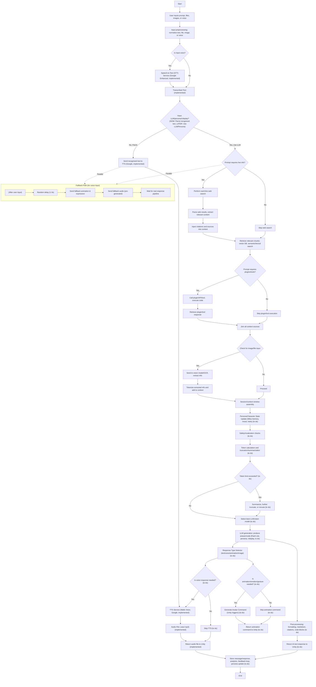

# Project Mika AI 🌸

**An Anime AI Companion with Voice Interaction and Intelligent Responses**

Mika is an interactive anime AI companion built with Unity that combines advanced speech processing, artificial intelligence, and real-time avatar animation to create an engaging conversational experience. Whether you want to chat, ask questions, or simply interact with a responsive AI personality, Mika brings your anime companion dreams to life.

## ✨ Features

### 🎤 **Currently Implemented**
- **Voice Input & Output**: Real-time speech-to-text and text-to-speech conversion using Google services
- **Audio Processing**: High-quality voice processing with waifu voice synthesis
- **Unity Integration**: Seamless audio and animation command handling
- **Real-time Response**: Fallback animation system for immediate user feedback
- **Microphone Recording**: Built-in voice capture functionality
- **Expression Control**: Dynamic facial expressions and lip sync

### 🔮 **Planned Features**
- **Advanced AI Persona**: Memory, mood tracking, and character trait evolution
- **Multi-modal Intelligence**: Vision processing for images and files
- **Web Search Integration**: Real-time information retrieval with citations
- **Plugin System**: Extensible tool and API integration
- **Smart Context Management**: Intelligent conversation history and summarization
- **Enhanced Animations**: Gesture recognition and emotion-based movements
- **Safety & Moderation**: Content filtering and user protection

## 🏗️ Architecture Overview

Mika's architecture is designed as a comprehensive AI pipeline that processes various input types and generates appropriate responses through multiple channels:



## 🛠️ Technical Stack

- **Frontend**: Unity 3D with C# scripting
- **Speech Processing**: Google Enhanced Speech-to-Text and Text-to-Speech services
- **Audio**: WAV/MP3 processing with real-time lip sync
- **Networking**: WebSocket communication for real-time interactions
- **Future**: Integration with advanced LLMs, vector databases, and web APIs

## 🗂️ Project Structure

```
project-mika-ai/
├── Scripts/                          # Unity C# scripts
│   ├── AnimationCommandReceiver.cs   # Handles avatar animations
│   ├── AudioCommandReceiver.cs       # Processes audio commands
│   ├── MicRecorder.cs                # Microphone input handling
│   ├── MikaExpressionController.cs   # Facial expression control
│   ├── SimpleLipSync.cs              # Lip synchronization
│   ├── WavUtility.cs                 # Audio file processing
│   └── NativeWebSocketExample.cs     # WebSocket communication
├── mika_func.md                      # Technical workflow documentation
└── README.md                         # This file
```

## 🚀 Getting Started

### Prerequisites

- Unity 2021.3 LTS or later
- Microphone access for voice input
- Internet connection for speech services

### Setup

1. **Clone the repository**
   ```bash
   git clone https://github.com/osmarbetancourt/project-mika-ai.git
   cd project-mika-ai
   ```

2. **Open in Unity**
   - Launch Unity Hub
   - Click "Add" and select the project folder
   - Open the project with Unity 2021.3 LTS or later

3. **Configure Audio Settings**
   - Ensure microphone permissions are granted
   - Test audio input/output in Unity's Audio settings

4. **Run the Project**
   - Open the main scene
   - Press Play to start interacting with Mika

## 💬 How to Interact with Mika

1. **Voice Input**: Speak into your microphone - Mika will transcribe and respond
2. **Current Mode**: In the current implementation, Mika will repeat back what you say using text-to-speech
3. **Future Modes**: Advanced AI conversations, web search integration, and multi-modal interactions

## 🎯 Development Status

| Feature | Status | Notes |
|---------|--------|-------|
| Speech-to-Text | ✅ Implemented | Google Enhanced STT |
| Text-to-Speech | ✅ Implemented | Waifu voice synthesis |
| Audio Processing | ✅ Implemented | WAV/MP3 support |
| Unity Integration | ✅ Implemented | Animation & audio commands |
| Fallback Responses | ✅ Implemented | Immediate user feedback |
| LLM Integration | 🔄 Planned | Advanced AI conversations |
| Persona System | 🔄 Planned | Memory, mood, traits |
| Web Search | 🔄 Planned | Real-time information |
| Vision Processing | 🔄 Planned | Image and file analysis |
| Plugin System | 🔄 Planned | Extensible functionality |

## 🤝 Contributing

We welcome contributions to make Mika even better! Here's how you can help:

1. **Fork the repository**
2. **Create a feature branch** (`git checkout -b feature/amazing-feature`)
3. **Commit your changes** (`git commit -m 'Add amazing feature'`)
4. **Push to the branch** (`git push origin feature/amazing-feature`)
5. **Open a Pull Request**

### Areas We Need Help With

- 🧠 **AI Integration**: Implementing LLM conversation capabilities
- 🎨 **Animation System**: Enhanced avatar expressions and gestures
- 🔍 **Web Search**: Real-time information retrieval
- 🛡️ **Safety**: Content moderation and user protection
- 📱 **Platform Support**: Mobile and web deployment
- 🎵 **Audio**: Voice quality improvements and effects

## 📋 Roadmap

### Phase 1: Foundation (Current)
- [x] Basic voice input/output
- [x] Unity integration
- [x] Audio processing pipeline

### Phase 2: Intelligence (In Progress)
- [ ] LLM integration for conversations
- [ ] Basic persona system
- [ ] Context management

### Phase 3: Advanced Features
- [ ] Multi-modal input (images, files)
- [ ] Web search integration
- [ ] Plugin ecosystem
- [ ] Advanced animations

### Phase 4: Polish & Distribution
- [ ] Mobile platform support
- [ ] Performance optimization
- [ ] User customization options

## 📄 License

This project is licensed under the MIT License - see the [LICENSE](LICENSE) file for details.

## 🙏 Acknowledgments

- Google Cloud Speech Services for STT/TTS capabilities
- Unity Technologies for the development platform
- The open-source community for inspiration and support

## 📞 Contact

For questions, suggestions, or collaboration opportunities, please open an issue on GitHub or reach out to the development team.

---

**Ready to meet Mika? Star this repository and join the journey of creating the ultimate anime AI companion! 🌟**