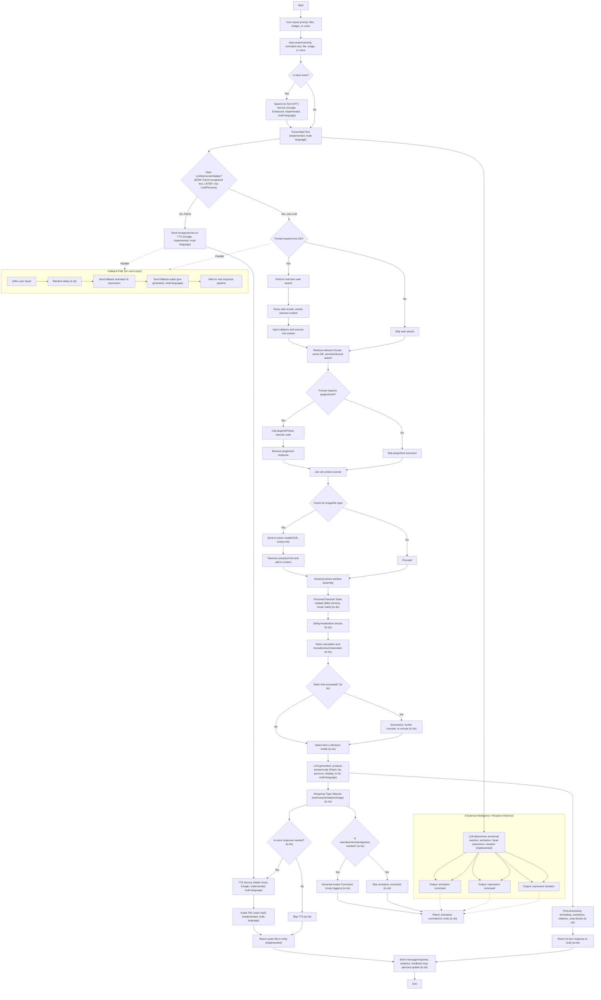
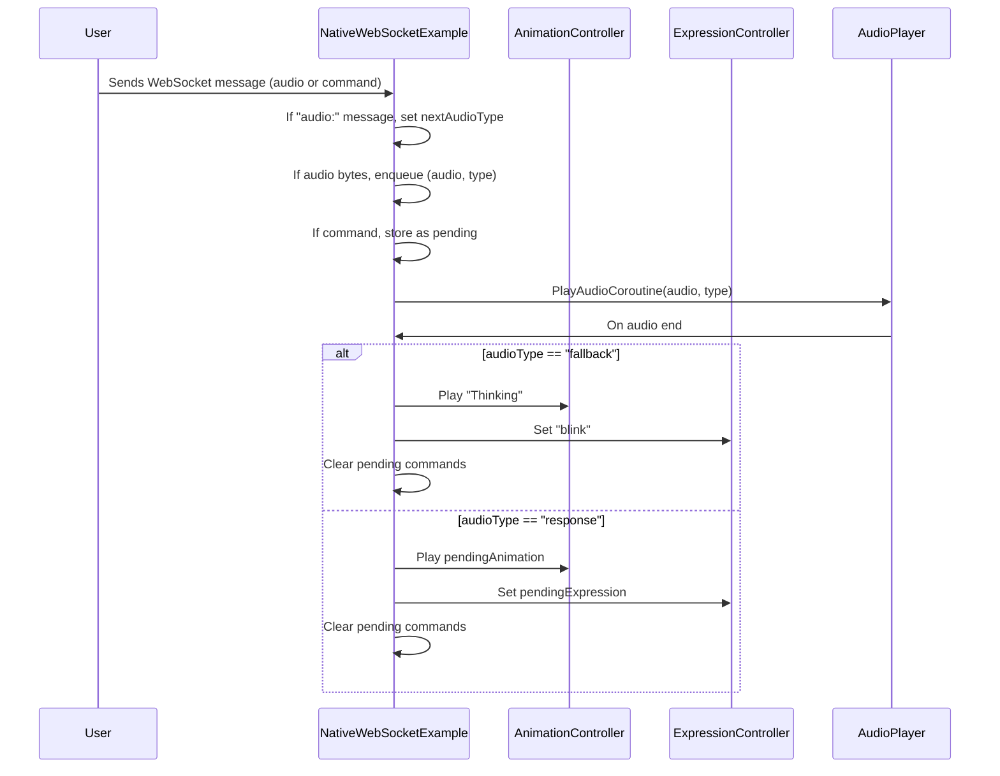

# Project Mika AI 🌸

**An Anime AI Companion with Voice Interaction and Intelligent Responses**

<div align="center">
  
  <p><em>Meet Mika - Your Anime AI Companion</em></p>
</div>

Mika is an interactive anime AI companion built with Unity that combines advanced speech processing, artificial intelligence, and real-time avatar animation to create an engaging conversational experience. Whether you want to chat, ask questions, or simply interact with a responsive AI personality, Mika brings your anime companion dreams to life.

### ✨ Recent Technical Improvements
- **Google Vertex AI Integration**: Migrated from hardcoded API URLs to official Google Vertex AI SDK for Python
- **Hybrid RAG Architecture**: Combines fuzzy search on facts table with semantic vector database (Faiss) for intelligent context retrieval
- **Optimized Memory Management**: 12,000 token context window with 200-message fast cache for enhanced performance
- **Background Processing**: Fact extraction, semantic embedding, and classification run in separate threads for responsiveness

## ✨ Features

### 🎤 **MVP v1 - Currently Implemented**
- **Voice Input & Output**: Real-time speech-to-text and text-to-speech conversion using Google services *(Audio input only)*
- **Audio Processing**: High-quality voice processing with waifu voice synthesis
- **Unity Integration**: Seamless audio and animation command handling with synchronized visual responses
- **Real-time Response**: Fallback animation system for immediate user feedback
- **Microphone Recording**: Built-in voice capture functionality
- **Expression Control**: Dynamic facial expressions and lip sync synchronized with audio - **Unity C# animation system fully implemented**
- **Emotional Intelligence**: LLM-powered emotional reaction inference that determines appropriate animations, facial expressions, and durations based on conversation context
- **Multi-language Support**: Supports English, Spanish, and Japanese languages
- **LLM Integration**: Advanced AI conversations using Gemini Flash 2.5 and Flash Lite 2.5
- **Enhanced Memory System**: Supports up to 12K tokens per request with cache for 200 most recent messages, featuring hybrid RAG approach with fuzzy search and semantic vector database
- **Time & Date Awareness**: Mika is aware of the current day, date, and tracks when the user last sent a message

### 🚧 **Next Steps (Post-MVP)**
- **Distribution Ready**: Package as .exe or installation wizard for user consumption
- **Enhanced Web Search**: Improved real-time information retrieval and processing capabilities *(Future consideration, not prioritized for v1)*

### 🔮 **Future Versions (Not in MVP v1)**
- **Multi-modal Input/Output**: Vision processing for images and files *(Not in v1)*
- **URL Parsing**: Web content processing *(Not in v1)*
- **Plugin System**: Extensible tool and API integration
- **Enhanced Web Search**: Real-time information retrieval with citations
- **Advanced AI Persona**: Character trait evolution and mood coordination
- **Safety & Moderation**: Content filtering and user protection

## 🏗️ Architecture Overview

Mika's architecture is designed as a comprehensive AI pipeline that processes various input types and generates appropriate responses through multiple channels:



## 🎭 Animation & Expression System

Mika's animation and expression system works through a sophisticated WebSocket-based communication pipeline that coordinates audio playback with visual responses:



This system ensures that Mika's visual responses (animations and facial expressions) are perfectly synchronized with her audio responses, providing a natural and engaging interaction experience.

## 🛠️ Technical Stack

- **Frontend**: Unity 3D with C# scripting
- **Speech Processing**: Google Enhanced Speech-to-Text and Text-to-Speech services
- **Audio**: WAV/MP3 processing with real-time lip sync
- **Networking**: WebSocket communication for real-time interactions
- **AI**: Google Vertex AI SDK with Gemini Flash 2.5 and Flash Lite 2.5 for conversation processing
- **Memory System**: Hybrid RAG approach with fuzzy search (facts table) and semantic search (Faiss vector database)
- **Context Management**: Up to 12K tokens per request with 200-message cache for optimal performance

## 🗂️ Project Structure

```
project-mika-ai/
├── Scripts/                          # Unity C# scripts
│   ├── AnimationCommandReceiver.cs   # Handles avatar animations
│   ├── AudioCommandReceiver.cs       # Processes audio commands
│   ├── MicRecorder.cs                # Microphone input handling
│   ├── MikaExpressionController.cs   # Facial expression control
│   ├── SimpleLipSync.cs              # Lip synchronization
│   ├── WavUtility.cs                 # Audio file processing
│   └── NativeWebSocketExample.cs     # WebSocket communication & animation coordination
├── mika_func.md                      # Detailed technical workflow documentation
└── README.md                         # This file
```

For detailed technical documentation about Mika's internal workflow and architecture, see [mika_func.md](mika_func.md).

## 🚀 Getting Started

### Prerequisites

- Unity 2021.3 LTS or later
- Microphone access for voice input
- Internet connection for speech services

### Setup

1. **Clone the repository**
   ```bash
   git clone https://github.com/osmarbetancourt/project-mika-ai.git
   cd project-mika-ai
   ```

2. **Open in Unity**
   - Launch Unity Hub
   - Click "Add" and select the project folder
   - Open the project with Unity 2021.3 LTS or later

3. **Configure Audio Settings**
   - Ensure microphone permissions are granted
   - Test audio input/output in Unity's Audio settings

4. **Run the Project**
   - Open the main scene
   - Press Play to start interacting with Mika

## 💬 How to Interact with Mika

1. **Voice Input Only**: Speak into your microphone - Mika will transcribe and respond *(MVP v1 supports audio input only)*
2. **AI Conversations**: Mika features advanced AI conversations powered by Google Vertex AI with intelligent memory management
3. **Multi-language**: Interact in English, Spanish, or Japanese
4. **Synchronized Responses**: Enjoy perfectly timed animations and expressions that match Mika's voice responses with the fully implemented Unity C# animation system
5. **Intelligent Memory**: Mika uses hybrid RAG with fuzzy search and semantic vectors to remember relevant context from up to 200 recent messages
6. **Time Awareness**: Mika knows what day it is and tracks when you last sent a message, providing contextually relevant responses

## 🎯 Development Status

| Feature | Status | Notes |
|---------|--------|-------|
| **MVP v1 Features** | | |
| Speech-to-Text | ✅ Implemented | Google Enhanced STT (Audio input only) |
| Text-to-Speech | ✅ Implemented | Waifu voice synthesis |
| Audio Processing | ✅ Implemented | WAV/MP3 support |
| Unity Integration | ✅ Implemented | Animation & audio commands with sync |
| Fallback Responses | ✅ Implemented | Immediate user feedback |
| LLM Integration | ✅ Implemented | Google Vertex AI SDK with Gemini models |
| Emotional Intelligence | ✅ Implemented | LLM-powered emotion inference |
| Hybrid Memory System | ✅ Implemented | 12K tokens, 200-message cache, fuzzy + semantic search |
| Multi-language Support | ✅ Implemented | English, Spanish, Japanese |
| Time/Date Awareness | ✅ Implemented | Current day, time, last message timestamp tracking |
| Unity Animation System | ✅ Implemented | C# animation and expression system fixed |
| **Next Steps** | | |
| Distribution Package | 🔄 Next Priority | .exe/installer for users |
| Enhanced Web Search | 🔄 Future Consideration | Real-time information processing *(not v1 priority)* |
| **Future Features** | | |
| Multi-modal Input/Output | ❌ Not in v1 | Images, files (future version) |
| URL Parsing | ❌ Not in v1 | Web content processing |
| Plugin System | 🔄 Future | Extensible functionality |
| Advanced Web Search | 🔄 Future | Real-time information with citations *(deprioritized for v1)* |
| Vision Processing | 🔄 Future | Image and file analysis |

## 🤝 Contributing

We welcome contributions to make Mika even better! Here's how you can help:

1. **Fork the repository**
2. **Create a feature branch** (`git checkout -b feature/amazing-feature`)
3. **Commit your changes** (`git commit -m 'Add amazing feature'`)
4. **Push to the branch** (`git push origin feature/amazing-feature`)
5. **Open a Pull Request**

## 📋 Roadmap

### Phase 1: MVP v1 Foundation (Current - Completed)
- [x] Voice input/output (audio only)
- [x] Unity integration with synchronized animations
- [x] Audio processing pipeline with emotional intelligence
- [x] LLM integration with Google Vertex AI SDK
- [x] Hybrid memory system (12K tokens, 200-message cache)
- [x] RAG implementation (fuzzy search + semantic vector database)
- [x] Multi-language support (EN/ES/JP)
- [x] Time and date awareness with message timestamp tracking
- [x] Unity C# animation and expression system implementation

### Phase 2: MVP v1 Polish (Next - In Progress)
- [ ] Distribution packaging (.exe/installer)
- [ ] Performance optimization and stability improvements

### Phase 3: Enhanced Features (Future)
- [ ] Multi-modal input (images, files, text)
- [ ] URL parsing and web content processing
- [ ] Enhanced web search with real-time information *(reconsidering priority)*
- [ ] Plugin ecosystem and API integrations

### Phase 4: Advanced AI & Polish (Future)
- [ ] Advanced persona system with trait evolution
- [ ] Mobile platform support
- [ ] Performance optimization
- [ ] Enhanced safety and moderation systems

## 📄 License

This project is licensed under the MIT License - see the [LICENSE](LICENSE) file for details.

## 🙏 Acknowledgments

- Google Cloud Speech Services for STT/TTS capabilities
- Unity Technologies for the development platform
- The open-source community for inspiration and support

## 📞 Contact

For questions, suggestions, or collaboration opportunities, please open an issue on GitHub or reach out to the development team.

---

**Ready to meet Mika? Star this repository and join the journey of creating the ultimate anime AI companion! 🌟**