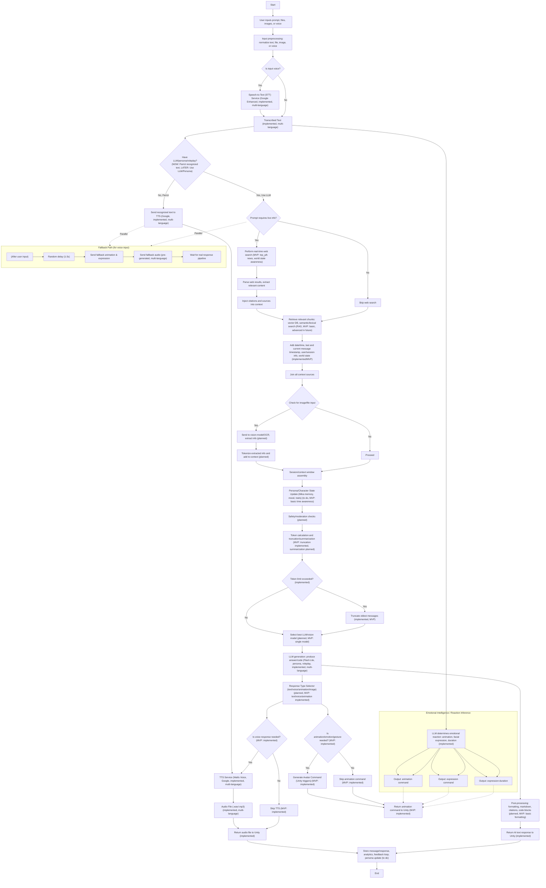

```mermaid
flowchart TD
    Start["Start"] --> UserInput["User inputs prompt, files, images, or voice"]
    UserInput --> Preprocess["Input preprocessing: normalize text, file, image, or voice"]

    Preprocess --> IsVoice{"Is input voice?"}
    IsVoice -- Yes --> STT["Speech-to-Text (STT) Service (Google Enhanced, implemented, multi-language)"]
    STT --> TranscribedText["Transcribed Text (implemented, multi-language)"]
    IsVoice -- No --> TranscribedText

    TranscribedText --> ParrotCheck{"Have LLM/persona/roleplay?\n(NOW: Parrot recognized text, LATER: Use LLM/Persona)"}
    ParrotCheck -- No, Parrot --> ParrotLogic["Send recognized text to TTS (Google, implemented, multi-language)"]
    ParrotCheck -- Yes, Use LLM --> NeedsLiveInfo{"Prompt requires live info?"}

    %% Emotional intelligence injection step (NEW)
    subgraph EmotionIntelligence["Emotional Intelligence / Reaction Inference"]
        direction LR
        EmotionLLM["LLM determines emotional reaction: animation, facial expression, duration (implemented)"]
        EmotionLLM --> AnimCmdOut["Output: animation command"]
        EmotionLLM --> ExprCmdOut["Output: expression command"]
        EmotionLLM --> ExprDurOut["Output: expression duration"]
    end

    %% Fallback logic starts here
    subgraph FallbackParallel["Fallback Path (for voice input)"]
        direction LR
        AwaitInput["(After user input)"] --> RandomDelay["Random delay (1-3s)"]
        RandomDelay --> SendFallbackAnim["Send fallback animation & expression"]
        SendFallbackAnim --> SendFallbackAudio["Send fallback audio (pre-generated, multi-language)"]
        SendFallbackAudio --> WaitRealAnswer["Wait for real response pipeline"]
    end

    ParrotLogic -.->|Parallel| FallbackParallel
    NeedsLiveInfo -.->|Parallel| FallbackParallel

    %% Continue regular logic
    ParrotLogic --> TTS["TTS Service (Waifu Voice, Google, implemented, multi-language)"]
    TTS --> AudioFile["Audio File (.wav/.mp3) (implemented, multi-language)"]
    AudioFile --> ReturnAudio["Return audio file to Unity (implemented)"]
    ReturnAudio --> Store["Store message/response, analytics, feedback loop, persona update (to do)"]
    Store --> End["End"]

    NeedsLiveInfo -- Yes --> WebSearch["Perform real-time web search (MVP: top_p/k news, world state awareness)"]
    WebSearch --> ParseWeb["Parse web results, extract relevant content"]
    ParseWeb --> CiteInject["Inject citations and sources into context"]
    NeedsLiveInfo -- No --> SkipWeb["Skip web search"]
    CiteInject --> RetrieveChunks["Retrieve relevant chunks: vector DB, semantic/lexical search (RAG, MVP: basic, advanced in future)"]
    SkipWeb --> RetrieveChunks

    RetrieveChunks --> AddConscience["Add date/time, last and current message timestamp, user/session info, world state (implemented/MVP)"]
    AddConscience --> JoinContext["Join all context sources"]

    JoinContext --> HasImage{"Check for image/file input"}
    HasImage -- Yes --> Vision["Send to vision model/OCR, extract info (planned)"]
    Vision --> TokenizeExtracted["Tokenize extracted info and add to context (planned)"]
    HasImage -- No --> Proceed["Proceed"]
    TokenizeExtracted --> SessionAssembly["Session/context window assembly"]
    Proceed --> SessionAssembly

    SessionAssembly --> Persona["Persona/Character State Update (Mika memory, mood, traits) (to do, MVP: basic time awareness)"]
    Persona --> Moderation["Safety/moderation checks (planned)"]
    Moderation --> Tokens["Token calculation and truncation/summarization (MVP: truncation implemented, summarization planned)"]
    Tokens --> TokenLimit{"Token limit exceeded? (implemented)"}
    TokenLimit -- Yes --> Truncate["Truncate oldest messages (implemented, MVP)"]
    TokenLimit -- No --> ModelSelect["Select best LLM/vision model (planned, MVP: single model)"]
    Truncate --> ModelSelect

    ModelSelect --> LLM["LLM generation: produce answer/code (Flash Lite, persona, roleplay, implemented, multi-language)"]
    LLM --> RespType["Response Type Selector (text/voice/animation/image) (planned, MVP: text/voice/animation implemented)"]

    RespType --> NeedsVoice{"Is voice response needed? (MVP: implemented)"}
    NeedsVoice -- Yes --> TTS
    NeedsVoice -- No --> SkipTTS["Skip TTS (MVP: implemented)"]

    RespType --> NeedsAnim{"Is animation/emotion/gesture needed? (MVP: implemented)"}
    NeedsAnim -- Yes --> AnimCmd["Generate Avatar Command (Unity triggers) (MVP: implemented)"]
    NeedsAnim -- No --> SkipAnim["Skip animation command (MVP: implemented)"]

    AnimCmd --> ReturnAnim["Return animation command to Unity (MVP: implemented)"]
    SkipAnim --> ReturnAnim

    LLM --> PostProc["Post-processing: formatting, markdown, citations, code blocks (planned, MVP: basic formatting)"]
    PostProc --> ReturnText["Return AI text response to Unity (implemented)"]

    ReturnText --> Store
    SkipTTS --> ReturnAudio

    %% Emotional intelligence step injection points
    TranscribedText --> EmotionLLM
    EmotionLLM --> AnimCmdOut
    EmotionLLM --> ExprCmdOut
    EmotionLLM --> ExprDurOut
    AnimCmdOut -.-> ReturnAnim
    ExprCmdOut -.-> ReturnAnim
    ExprDurOut -.-> ReturnAnim

    %% Comments:
    %% - MVP: STT, ParrotLogic, TTS, ReturnAudio, fallback, emotional intelligence, truncation (not summarization), RAG (basic), conscience (date/time/timestamps/news/world state), persona, animation, top_p/k web pages/news are implemented.
    %% - Multimodal input/output, plugin/tools, advanced RAG, summarization, moderation/safety, advanced persona update, post-processing, model selection, and file access are planned for next phases.
    %% - All speech/text/LLM/emotion steps support dynamic language selection (English, Spanish, Japanese).
    %% - Message context is truncated (not summarized) for performance. Unlimited message memory unless pruned via admin action.
    %% - Mika can reference today’s date, current/last message timestamp, and world state in responses.
    %% - MVP does not include multimodal outputs, plugin/file access, or deep system integration.

%% -------------------------------------------------------------------------------------
%% --- NEW (2025 UPDATE): Google Vertex AI, Fuzzy Fact Search, Faiss Vector DB, Threads, and Large Context ---
%% -------------------------------------------------------------------------------------

%% - LLM backend is now Google Vertex AI SDK for Python (Gemini, Flash Lite, Embedding models).
%% - Fact memory is implemented using fuzzy search (difflib) over a facts table. Only the most relevant facts (up to 20) are injected into context per turn.
%% - Semantic memory uses Faiss vector DB for similarity search (vector retrieval augmented generation).
%% - Conversation history supports up to 12,000 tokens and ~200 messages in fast cache. Remainder is managed in DB, passed as context, or pruned.
%% - Fact extraction, semantic vector embedding, and classification run in background threads for performance and responsiveness.
%% - All context assembly (facts, semantic memories, recent turns) is dynamically pruned if token limits are reached, prioritizing most relevant data.
%% - Persona and world state are continually updated using extracted facts and semantic memories.
%% - System can handle large memory tables efficiently, limiting prompt injection to only top results.
%% - All new architecture supports multi-language (English, Spanish, Japanese), with dynamic switching.

%% -------------------------------------------------------------------------------------
```
