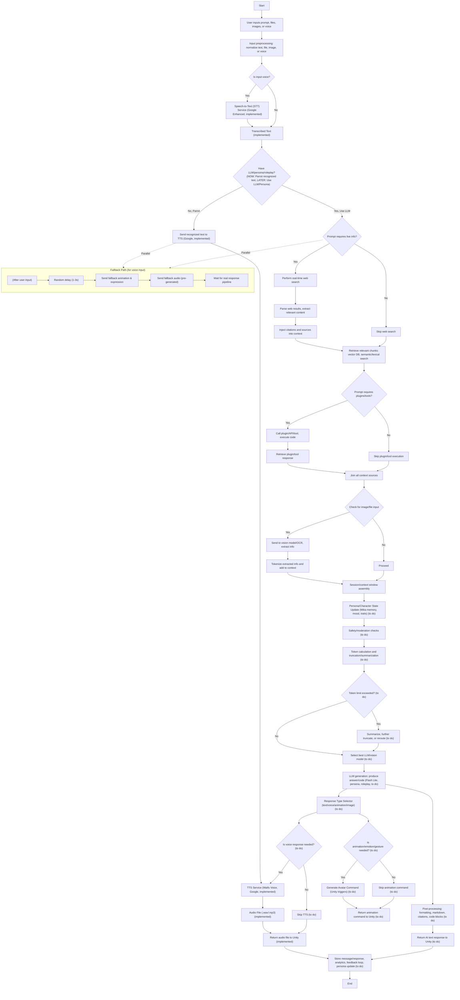

```mermaid
flowchart TD
    Start["Start"] --> UserInput["User inputs prompt, files, images, or voice"]
    UserInput --> Preprocess["Input preprocessing: normalize text, file, image, or voice"]

    Preprocess --> IsVoice{"Is input voice?"}
    IsVoice -- Yes --> STT["Speech-to-Text (STT) Service (Google Enhanced, implemented)"]
    STT --> TranscribedText["Transcribed Text (implemented)"]
    IsVoice -- No --> TranscribedText

    TranscribedText --> ParrotCheck{"Have LLM/persona/roleplay?\n(NOW: Parrot recognized text, LATER: Use LLM/Persona)"}
    ParrotCheck -- No, Parrot --> ParrotLogic["Send recognized text to TTS (Google, implemented)"]
    ParrotCheck -- Yes, Use LLM --> NeedsLiveInfo{"Prompt requires live info?"}

    %% Fallback logic starts here
    subgraph FallbackParallel["Fallback Path (for voice input)"]
        direction LR
        AwaitInput["(After user input)"] --> RandomDelay["Random delay (1-3s)"]
        RandomDelay --> SendFallbackAnim["Send fallback animation & expression"]
        SendFallbackAnim --> SendFallbackAudio["Send fallback audio (pre-generated)"]
        SendFallbackAudio --> WaitRealAnswer["Wait for real response pipeline"]
    end

    ParrotLogic -.->|Parallel| FallbackParallel
    NeedsLiveInfo -.->|Parallel| FallbackParallel

    %% Continue regular logic
    ParrotLogic --> TTS["TTS Service (Waifu Voice, Google, implemented)"]
    TTS --> AudioFile["Audio File (.wav/.mp3) (implemented)"]
    AudioFile --> ReturnAudio["Return audio file to Unity (implemented)"]
    ReturnAudio --> Store["Store message/response, analytics, feedback loop, persona update (to do)"]
    Store --> End["End"]

    NeedsLiveInfo -- Yes --> WebSearch["Perform real-time web search"]
    WebSearch --> ParseWeb["Parse web results, extract relevant content"]
    ParseWeb --> CiteInject["Inject citations and sources into context"]
    NeedsLiveInfo -- No --> SkipWeb["Skip web search"]
    CiteInject --> RetrieveChunks["Retrieve relevant chunks: vector DB, semantic/lexical search"]
    SkipWeb --> RetrieveChunks

    RetrieveChunks --> NeedsPlugin{"Prompt requires plugins/tools?"}
    NeedsPlugin -- Yes --> PluginCall["Call plugin/API/tool, execute code"]
    PluginCall --> PluginResp["Retrieve plugin/tool response"]
    NeedsPlugin -- No --> SkipPlugin["Skip plugin/tool execution"]
    PluginResp --> JoinContext["Join all context sources"]
    SkipPlugin --> JoinContext

    JoinContext --> HasImage{"Check for image/file input"}
    HasImage -- Yes --> Vision["Send to vision model/OCR, extract info"]
    Vision --> TokenizeExtracted["Tokenize extracted info and add to context"]
    HasImage -- No --> Proceed["Proceed"]
    TokenizeExtracted --> SessionAssembly["Session/context window assembly"]
    Proceed --> SessionAssembly

    SessionAssembly --> Persona["Persona/Character State Update (Mika memory, mood, traits) (to do)"]
    Persona --> Moderation["Safety/moderation checks (to do)"]
    Moderation --> Tokens["Token calculation and truncation/summarization (to do)"]
    Tokens --> TokenLimit{"Token limit exceeded? (to do)"}
    TokenLimit -- Yes --> Summarize["Summarize, further truncate, or reroute (to do)"]
    TokenLimit -- No --> ModelSelect["Select best LLM/vision model (to do)"]
    Summarize --> ModelSelect

    ModelSelect --> LLM["LLM generation: produce answer/code (Flash Lite, persona, roleplay, to do)"]
    LLM --> RespType["Response Type Selector (text/voice/animation/image) (to do)"]

    RespType --> NeedsVoice{"Is voice response needed? (to do)"}
    NeedsVoice -- Yes --> TTS
    NeedsVoice -- No --> SkipTTS["Skip TTS (to do)"]

    RespType --> NeedsAnim{"Is animation/emotion/gesture needed? (to do)"}
    NeedsAnim -- Yes --> AnimCmd["Generate Avatar Command (Unity triggers) (to do)"]
    NeedsAnim -- No --> SkipAnim["Skip animation command (to do)"]

    AnimCmd --> ReturnAnim["Return animation command to Unity (to do)"]
    SkipAnim --> ReturnAnim

    LLM --> PostProc["Post-processing: formatting, markdown, citations, code blocks (to do)"]
    PostProc --> ReturnText["Return AI text response to Unity (to do)"]

    ReturnText --> Store
    SkipTTS --> ReturnAudio

    %% Comments:
    %% - STT, ParrotLogic, TTS, ReturnAudio are implemented
    %% - LLM, persona, RAG, plugins, websearch, and multimodal outputs are planned
    %% - Fallback logic is now implemented and runs in parallel as soon as possible after user input
```